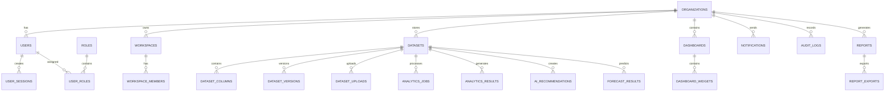

```mermaid
erDiagram

ORGANIZATIONS ||--o{ USERS : has
ORGANIZATIONS ||--o{ WORKSPACES : owns
ORGANIZATIONS ||--o{ DATASETS : stores
ORGANIZATIONS ||--o{ DASHBOARDS : contains
ORGANIZATIONS ||--o{ REPORTS : generates
ORGANIZATIONS ||--o{ NOTIFICATIONS : sends
ORGANIZATIONS ||--o{ AUDIT_LOGS : records

USERS ||--o{ USER_SESSIONS : creates
USERS ||--o{ USER_ROLES : assigned

ROLES ||--o{ USER_ROLES : contains

WORKSPACES ||--o{ WORKSPACE_MEMBERS : has

DATASETS ||--o{ DATASET_COLUMNS : contains
DATASETS ||--o{ DATASET_VERSIONS : versions
DATASETS ||--o{ DATASET_UPLOADS : uploads
DATASETS ||--o{ ANALYTICS_JOBS : processes
DATASETS ||--o{ ANALYTICS_RESULTS : generates
DATASETS ||--o{ AI_RECOMMENDATIONS : creates
DATASETS ||--o{ FORECAST_RESULTS : predicts

DASHBOARDS ||--o{ DASHBOARD_WIDGETS : contains

REPORTS ||--o{ REPORT_EXPORTS : exports
```