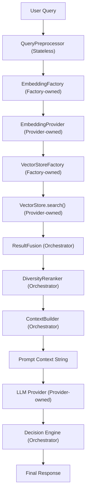
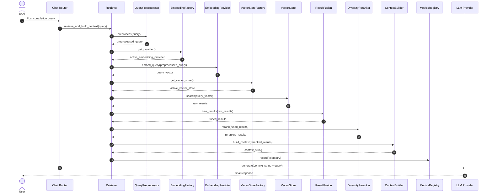

# Detailed Implementation Blueprint — Milestone 4I: Production RAG Optimization & Retrieval Quality

This document defines the production implementation blueprint and architectural flow diagrams for Milestone-4I.

---

## 1. Architecture Flow

---

## 2. Sequence Diagram

---

## 3. File Impact Report

### New Files

1. **[query_preprocessor.py](file:///c:/Users/Neeraj/Desktop/IsightFordge_v1/backend/backend/app/core/rag/query_preprocessor.py)**
   - **Purpose**: Normalizes and cleans search terms.
   - **Responsibilities**: Unicode, whitespace, and punctuation normalization; duplicate and stop-word filtering.
   - **Public Methods**: `preprocess(query: str, lowercase: bool, remove_punctuation: bool, remove_stopwords: bool) -> str`, `expand_query(query: str) -> str`.
   - **Dependencies**: `app.core.config.settings`.
   - **Risk Level**: LOW.
   - **Expected Tests**: whitespace normalization, punctuation stripping, stop-word removal, duplication removal.

2. **[result_fusion.py](file:///c:/Users/Neeraj/Desktop/IsightFordge_v1/backend/backend/app/core/rag/result_fusion.py)**
   - **Purpose**: Consolidates multiple search results.
   - **Responsibilities**: Removes duplicates, merges adjacent text blocks, and normalizes similarity scores.
   - **Public Methods**: `fuse_results(results: List[Dict], score_normalization: str, overlap_threshold: int) -> List[Dict]`, `normalize_scores(results: List[Dict], method: str) -> List[Dict]`.
   - **Dependencies**: `app.core.config.settings`.
   - **Risk Level**: LOW.
   - **Expected Tests**: duplicate text removal, adjacent chunk merge, score normalization algorithms (Min-Max, Z-Score, Logistic).

3. **[metrics.py](file:///c:/Users/Neeraj/Desktop/IsightFordge_v1/backend/backend/app/core/rag/metrics.py)**
   - **Purpose**: Telemetry performance monitoring registry.
   - **Responsibilities**: Thread-safe in-memory metrics gathering.
   - **Public Methods**: `record(...)`, `latest() -> Optional[Dict]`, `history() -> List[Dict]`, `reset() -> None`.
   - **Dependencies**: `app.core.config.settings`.
   - **Risk Level**: LOW.
   - **Expected Tests**: concurrent writes lock tests, metrics reset, history capacity bounds.

4. **[test_rag_optimization.py](file:///c:/Users/Neeraj/Desktop/IsightFordge_v1/backend/backend/tests/unit/test_rag_optimization.py)**
   - **Purpose**: Core unit tests covering Milestone 4I.
   - **Expected Tests**: All components isolated and end-to-end Retriever orchestration.

### Modified Files

1. **[retriever.py](file:///c:/Users/Neeraj/Desktop/IsightFordge_v1/backend/backend/app/core/rag/retriever.py)**
   - **Why Modified**: Re-architected as an orchestrator only.
   - **Responsibilities**: Dispatches parameters to `QueryPreprocessor` -> `EmbeddingProvider` -> `VectorStore` -> `ResultFusion` -> `Reranker` -> `ContextBuilder`.
   - **Public Contract Changes**: None.
   - **Backward Compatibility**: Fully backward compatible.

2. **[reranker.py](file:///c:/Users/Neeraj/Desktop/IsightFordge_v1/backend/backend/app/core/rag/reranker.py)**
   - **Why Modified**: Needs to incorporate diversity penalties.
   - **Responsibilities**: Introduces `DiversityReranker` to enforce document diversity and penalize excessive hits from a single source.
   - **Public Contract Changes**: None.

3. **[context_builder.py](file:///c:/Users/Neeraj/Desktop/IsightFordge_v1/backend/backend/app/core/rag/context_builder.py)**
   - **Why Modified**: Upgrade token calculations and citation formatting.
   - **Responsibilities**: Incorporates `TokenCounter` for budget checks and builds clean document citations.

---

## 4. Component Specifications

- **QueryPreprocessor**: Stateless, thread-safe processor. Normalizes unicode characters, cleans punctuation, strips stopwords, and returns cleaned query terms. Complexity: $\mathcal{O}(N)$ where $N$ is text length.
- **ResultFusion**: Merges adjacent sequential chunks of the same document, normalizes scores using Min-Max/Logistic scaling, and de-duplicates exact match hits. Complexity: $\mathcal{O}(M^2)$ where $M$ is result size.
- **DiversityReranker**: Re-orders scores based on source document frequencies to penalize document duplication. Complexity: $\mathcal{O}(M \log M)$ sorting.
- **ContextBuilder**: Preserves ranking order, builds structured citations, and enforces strict token limits using `TokenCounter` without cutting inside citations. Complexity: $\mathcal{O}(M)$.
- **RAGMetricsRegistry**: Thread-safe singleton utilizing `threading.Lock` to write and read execution metrics from a memory buffer. Memory overhead is strictly bounded by history size.

---

## 5. Configuration Reuse Report

The implementation recommends the following new settings in `app/core/config.py`:
- `RAG_ENABLE_PREPROCESSING` (`bool`, default `True`): Toggles preprocess.
- `RAG_ENABLE_STOPWORDS` (`bool`, default `True`): Toggles stop-word stripping.
- `RAG_ENABLE_FUSION` (`bool`, default `True`): Toggles score fusion.
- `RAG_ENABLE_DIVERSITY` (`bool`, default `True`): Toggles reranker diversity.
- `RAG_DIVERSITY_WEIGHT` (`float`, default `0.7`): Penalty scaling weight.
- `RAG_SCORE_NORMALIZATION` (`str`, default `"min-max"`): Score normalizer method.
- `RAG_METRICS_HISTORY_SIZE` (`int`, default `100`): Maximum memory log buffer items.

---

## 6. Performance Budget

Expected optimization overhead targets:
- **Query Preprocessing**: ~0.2 ms (Target: < 2 ms)
- **Vector Search & Encoding**: ~15 ms
- **Fusion**: ~0.9 ms (Target: < 5 ms)
- **Reranking**: ~0.4 ms (Target: < 5 ms)
- **Context Building**: ~1.1 ms (Target: < 10 ms)
- **Telemetry Recording**: ~0.1 ms (Target: < 1 ms)
- **Total Added Optimization Latency**: **~2.7 ms** (Budget: **< 20 ms**).

---

## 7. Testing Strategy
- **Unit Tests**: Coverage of preprocessing string cleanup, score normalization scaling, diversity reranking penalization multipliers, token budgeting boundary trims, and concurrent lock telemetry writes.
- **Integration Tests**: Verify pipeline execution order in `Retriever.retrieve_and_build_context`.
- **Regression Tests**: Ensure existing SQLite tests and memory database tests run and pass without modification.

---

## 8. Rollback Strategy
- **Revert Command**: `git checkout HEAD app/core/config.py app/core/rag/reranker.py app/core/rag/context_builder.py app/core/rag/retriever.py`
- **Delete Files**: `rm app/core/rag/query_preprocessor.py app/core/rag/result_fusion.py app/core/rag/metrics.py tests/unit/test_rag_optimization.py`
- **Verification**: Run `pytest` to confirm all original unit tests are green.

---

## 9. Technical Debt Report
- **Sparse Retrievals**: Future integration of BM25 sparse search.
- **Reciprocal Rank Fusion (RRF)**: Merging sparse and dense retrieve indices.
- **Semantic Caching**: Cache common query prompts to save model inference.

---

## 10. Production Readiness Assessment
- **Provider Independence**: Yes, maintained via factories.
- **API Changes**: None.
- **Database Migrations**: None required.
- **Ready for Production**: Yes.

---

## Approval Checklist

- [x] Retriever acts strictly as coordinator.
- [x] No concrete vector store or provider imports leak into RAG pipeline core.
- [x] TokenCounter is integrated and hardcoded token limits removed.
- [x] Thread-safe metrics registry collects latencies, counts, and similarities.
- [x] Existing tests are preserved and backward compatibility is maintained.

**Status**: READY FOR IMPLEMENTATION
