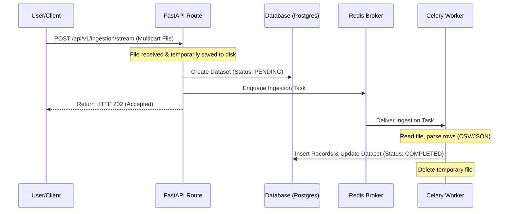

# Project State & Overview (Halat)

This document provides a comprehensive overview of the **Insights Forge Platform** (PAX 2.0) project. It contains current conditions, architecture, features, workflows, error fixes, detailed file/directory structures, known backlogs, and the roadmaps for next-step integration and deployment.

---

## 1. Project Condition & Status (Halat)

*   **Overall Condition**: The application backend is fully implemented and running locally. The database schema has been created, and Celery background workers are successfully integrated via a Redis broker.
*   **Backend Environment**: FastAPI + Uvicorn + Python 3.13. Running locally on `http://127.0.0.1:8000`.
*   **Database Status**: PostgreSQL (managed via SQLAlchemy async + Alembic). Schema conforms to Neon settings and is fully migrated.
*   **Caching & Queue**: Redis instance running on port `6379`. Celery worker running on a single worker thread (`solo` execution pool) processing ingestion tasks.
*   **Development Rules**: No paid external APIs are allowed. All database and Redis operations run using async/await patterns.

---

## 2. Platform Features

*   **Authentication & Session Management**: 
    *   JWT-based user authentication (15-minute access token, 7-day refresh token stored in `user_sessions`).
    *   Bcrypt-based password hashing.
    *   Transactional email flows powered by Brevo API (signup verification link, forgot/reset password tokens).
*   **Multi-Tenancy & RBAC**:
    *   Organization isolation where users and workspaces belong to specific organizations.
    *   Workspaces are linked to specific business sectors (retail, service, education, agriculture).
    *   Role-based access controls enforcing paths and sector matching against the caller's JWT scope.
*   **Data Ingestion & Storage**:
    *   Multipart file streaming (`POST /api/v1/ingestion/stream`).
    *   Parsing support for CSV and JSON (both arrays and newline-delimited formats).
    *   Records are parsed into a raw schema and stored inside the `records` PostgreSQL table.
*   **BI & Analytics Engine**:
    *   Forecast models and prediction queries.
    *   Dashboard configuration widgets.
    *   AI Recommendations (Decision Cards) linked to metrics.
    *   Threshold configuration alerts.

---

## 3. Core Workflow

---

## 4. Resolved Errors & Troubleshooting

1.  **SQLAlchemy Mapper initialization (`InvalidRequestError`)**:
    *   *Issue*: When Celery initialized tasks, the mapper failed to locate the `Organization` schema relationship, causing mapper initialization errors.
    *   *Resolution*: Imported `app.db.base` in `app/core/celery_app.py` to register all models to the SQLAlchemy metadata registry before task execution begins.
2.  **Celery Thread-Local App Mismatch (Connection Refused on AMQP)**:
    *   *Issue*: FastAPI request handlers executing in separate worker threads fell back to an unconfigured process-wide Celery instance using default RabbitMQ settings (`amqp://localhost:5672//`) instead of the custom Redis broker.
    *   *Resolution*: Added `celery_app.set_default()` in `app/core/celery_app.py` to register the custom Redis app as the process-wide default, forcing standard `.delay()` calls to route to Redis.
3.  **Bcrypt Library Conflict**:
    *   *Issue*: Standard `passlib` bcrypt broke on newer bcrypt versions.
    *   *Resolution*: Implemented password hashing/verification calling `bcrypt` directly to maintain compatibility.

---

## 5. File & Directory Inventory

### `backend/` (FastAPI Service)
*   [main.py](file:///c:/Users/Neeraj/Desktop/IsightFordge_v1/backend/backend/app/main.py): Application entry point, mounts routes, error handlers, and middleware.
*   [app/core/](file:///c:/Users/Neeraj/Desktop/IsightFordge_v1/backend/backend/app/core/): Configuration (`config.py`), Security (`security.py`), and Celery application settings (`celery_app.py`).
*   [app/models/](file:///c:/Users/Neeraj/Desktop/IsightFordge_v1/backend/backend/app/models/): SQLAlchemy database models (including `user.py`, `organization.py`, `workspace.py`, `dataset.py`, `record.py`).
*   [app/api/v1/](file:///c:/Users/Neeraj/Desktop/IsightFordge_v1/backend/backend/app/api/v1/): Router endpoints mapping exactly to the frozen OpenAPI contract (`auth.py`, `ingestion.py`, `sectors.py`, etc.).
*   [app/services/](file:///c:/Users/Neeraj/Desktop/IsightFordge_v1/backend/backend/app/services/): File ingestion parsing and email delivery logic.
*   [app/tasks/](file:///c:/Users/Neeraj/Desktop/IsightFordge_v1/backend/backend/app/tasks/): Celery task definitions (`ingestion.py`).
*   [requirements.txt](file:///c:/Users/Neeraj/Desktop/IsightFordge_v1/backend/backend/requirements.txt): Python virtual environment dependencies.
*   [alembic/](file:///c:/Users/Neeraj/Desktop/IsightFordge_v1/backend/backend/alembic/): Alembic database migrations.

### `frontend/` (React SPA)
*   [package.json](file:///c:/Users/Neeraj/Desktop/IsightFordge_v1/frontend/package.json): Frontend Node packages and scripts.
*   [vite.config.ts](file:///c:/Users/Neeraj/Desktop/IsightFordge_v1/frontend/vite.config.ts): Vite build configuration.
*   [contract_reference.json.json](file:///c:/Users/Neeraj/Desktop/IsightFordge_v1/frontend/contract_reference.json.json): The frozen contract mapping 23 required API endpoints.
*   [src/](file:///c:/Users/Neeraj/Desktop/IsightFordge_v1/frontend/src/): Source React code containing views, layouts, state management, and asset stylings.

### `chatbot/` (Apex-AI Emotional Chatbot)
*   [Apex-AI-main/ai/](file:///c:/Users/Neeraj/Desktop/IsightFordge_v1/chatbot/Apex-AI-main/ai/): Chatbot agent pipelines, RAG implementations, and LLM interfaces.
*   [Apex-AI-main/master_system_prompt.txt](file:///c:/Users/Neeraj/Desktop/IsightFordge_v1/chatbot/Apex-AI-main/master_system_prompt.txt): The main system instructions and persona parameters for the emotional AI.
*   [Apex-AI-main/safety_guardrails.yaml](file:///c:/Users/Neeraj/Desktop/IsightFordge_v1/chatbot/Apex-AI-main/safety_guardrails.yaml): Response alignment rules and content safety checks.
*   [Apex-AI-main/assistant_personality_rules.json](file:///c:/Users/Neeraj/Desktop/IsightFordge_v1/chatbot/Apex-AI-main/assistant_personality_rules.json): Personality, tone, and empathy behaviors.

---

## 6. Project Backlog

*   **Compile Reports Support**: The `/reports/compile` endpoint is currently mocked with placeholder outputs (no real PDF or Excel generator is bound yet).
*   **Excel (.xlsx) Ingestion Parsing**: Integrate `openpyxl` parsing inside `_rows_from_bytes()` and configure loud task failures on 0 rows (currently scheduled in the current sprint).

---

## 7. Roadmap & Next Steps

1.  **Excel Ingestion Integration**: Apply the `openpyxl` dependency and parsing updates to complete Excel uploads.
2.  **Frontend Connection**:
    *   Point the React frontend application base API configuration to our local backend running at `http://127.0.0.1:8000/api/v1`.
    *   Configure `BACKEND_CORS_ORIGINS` in `.env` to allow the React development server URL (e.g. `http://localhost:5173`).
3.  **End-to-End Testing**:
    *   Verify complete auth signup, verification, login, dataset upload, and dashboard renders directly from the React UI.
    *   Perform chatbot query runs, ensuring they retrieve RAG data correctly from the postgres/vector DB.
4.  **GitHub Push**: Clean code, format files, and push the repository branches to the remote GitHub repository.
5.  **Production Deployment**: Config Docker/Compose files and deploy frontend, backend, database, and Redis/worker systems to the hosting environment.
